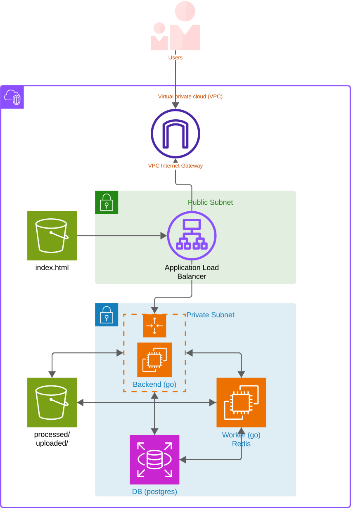

# ANB Rising Stars - Basketball Video Showcase Platform

A scalable basketball video showcase platform where players upload videos demonstrating their skills. Videos are processed asynchronously to ensure scalability and good user experience.

## Table of Contents
- [System Overview](#system-overview)
- [Architecture Diagram](#architecture-diagram)
- [Technology Stack](#technology-stack)
- [Key Features](#key-features)
- [Development Setup](#development-setup)
- [Production Deployment](#production-deployment)
- [API Documentation](#api-documentation)
- [Monitoring & Observability](#monitoring--observability)

## System Overview

The ANB Rising Stars platform enables basketball players to:
- Upload video demonstrations (20-60s, 1080p+)
- Have videos automatically processed to standardized format (720p, 16:9, max 30s)
- Vote on other players' videos (max 2 votes per user)
- View rankings and leaderboards
- Manage personal profiles and avatars

### Video Processing Pipeline
1. **Upload**: Videos uploaded to S3 uploads bucket
2. **Processing**: Asynchronous processing with FFmpeg
   - Trim to maximum 30 seconds
   - Normalize to 720p, 16:9 aspect ratio
   - Add intro/outro branding (ANB)
   - Remove audio
   - Generate thumbnails
3. **Storage**: Processed videos stored in S3 processed bucket
4. **Status Updates**: Real-time status tracking (`uploaded → processing → processed`)

## Architecture Diagram

<div align="center">

  

</div>

### Infrastructure Components

#### **Region: us-east-1**

#### **Frontend Tier**
- **S3 Bucket**: Static website hosting for React SPA

#### **API Tier**
- **Application Load Balancer (ALB)**: Public subnet, internet-facing
- **Auto Scaling Group (ASG)**: 2-5 instances in private subnets
- **EC2 Instances**: t3.micro, running containerized Go API
- **Launch Template**: Automated deployment and scaling

#### **Processing Tier**
- **EC2 Instance**: Dedicated worker in private subnet
- **Redis Container**: Job queue management
- **Docker Containers**: Worker + Redis co-located

#### **Storage Tier**
- **S3 Buckets**:
  - `uploads-bucket`: Original video files (private)
  - `processed-bucket`: Processed videos + thumbnails (public)
- **RDS PostgreSQL**: Application database in private subnet

#### **Configuration Management**
- **SSM Parameter Store**: Secrets and configuration
- **IAM Roles**: EC2 instance permissions
- **Security Groups**: Network access control

### Network Architecture

#### **VPC Configuration**
```
VPC (10.0.0.0/16)
├── Public Subnets 
│   └── Application Load Balancer
├── Private Subnets
│   ├── Auto Scaling Group (API instances)
│   ├── Worker/Redis EC2
│   └── RDS PostgreSQL
└── Internet Gateway → ALB only
```

#### **Security Groups**
| Component | Inbound | Outbound | Purpose |
|-----------|---------|----------|---------|
| ALB | 80,443 from 0.0.0.0/0 | 8080 to ASG | Public access |
| ASG | 8080 from ALB | 6379,5432,443 | API instances |
| Worker | 22 from Bastion | 6379,5432,443 | Processing |
| RDS | 5432 from ASG,Worker | None | Database |

## Technology Stack

### **Backend**
- **Language**: Go 1.23+
- **Web Framework**: Gorilla Mux
- **Database**: PostgreSQL with pgx driver
- **Queue**: Redis + Asynq
- **Video Processing**: FFmpeg
- **Authentication**: JWT tokens
- **File Storage**: AWS S3 SDK v2

### **Frontend**
- **Framework**: React 18 + Vite
- **Styling**: Bootstrap 5
- **Routing**: React Router
- **HTTP Client**: Fetch API
- **Icons**: Bootstrap Icons

### **Infrastructure**
- **Cloud Provider**: AWS
- **Containers**: Docker
- **Orchestration**: Auto Scaling Groups
- **Load Balancing**: Application Load Balancer
- **CDN**: CloudFront
- **Monitoring**: CloudWatch

### **Development Tools**
- **API Testing**: Postman/Newman
- **Code Quality**: SonarQube
- **Queue Monitoring**: Asynqmon
- **Database**: PostgreSQL CLI

## Key Features

### **User Management**
- User registration and authentication
- Profile management with avatar uploads
- City-based user categorization
- JWT-based session management

### **Video Management**
- Multipart file upload (up to 100MB)
- Asynchronous video processing
- Real-time processing status updates
- S3-based video delivery

### **Voting System**
- Maximum 2 votes per user
- Vote/unvote functionality
- Real-time vote counting
- User vote tracking

### **Rankings & Leaderboards**
- City-based rankings
- Global leaderboards
- Vote-based scoring system
- Real-time updates

## Development Setup

### **Prerequisites**
- Docker & Docker Compose
- Go 1.23+ (for local development)
- Node.js 18+ (for frontend development)
- PostgreSQL client (optional)

### **Environment Variables**
```env
# Database
POSTGRES_USER=anb
POSTGRES_PASSWORD=anbpass
POSTGRES_DB=anbdb
DB_DSN=postgres://anb:anbpass@db:5432/anbdb?sslmode=disable

# Authentication
JWT_SECRET=your-secret-key

# Redis
REDIS_ADDR=redis:6379

# AWS (Production)
AWS_REGION=us-east-1
AWS_ACCESS_KEY_ID=your-key
AWS_SECRET_ACCESS_KEY=your-secret
```

## Production Deployment

### **Pre-deployment Requirements**
1. **AWS Infrastructure Setup**
   - VPC with public/private subnets
   - RDS PostgreSQL database
   - S3 buckets (uploads, processed, frontend)
   - IAM roles and policies

2. **SSM Parameters**
   ```bash
   aws ssm put-parameter --name "/anb/s3/uploads-bucket" --value "your-uploads-bucket"
   aws ssm put-parameter --name "/anb/s3/processed-bucket" --value "your-processed-bucket"
   aws ssm put-parameter --name "/anb/db/password" --value "your-db-password" --type SecureString
   aws ssm put-parameter --name "/anb/jwt/secret" --value "your-jwt-secret" --type SecureString
   ```

### **Backend Deployment (Auto Scaling Group)**

#### **Launch Template**
```bash
# Build and push Docker image
docker build -t anb-showcase-backend:api -f back/Dockerfile.api back

# Create AMI from configured EC2 instance
# Configure Launch Template with:
# - Custom AMI
# - t3.medium instance type
# - IAM role with S3/SSM permissions
# - User data script for container startup
```

#### **Auto Scaling Configuration**
```yaml
Min Capacity: 2
Max Capacity: 5
Desired Capacity: 2
Health Check: /api/public/videos
Scaling Policies:
  - Scale Out: CPU > 70% for 2 minutes
```

### **Worker Deployment**
```bash
# Deploy on dedicated EC2 instance
docker run -d --name worker --restart unless-stopped \
  -e DB_DSN="${DB_DSN}" \
  -e REDIS_ADDR="localhost:6379" \
  --network host \
  -e AWS_REGION="${AWS_REGION}" \
  -v /home/ubuntu/ISIS4426-Entrega1/assets:/assets:ro \
  anb-showcase-backend:worker

docker run -d --name redis --restart unless-stopped   \
      -p 6379:6379   \
      -v worker_redis_data:/data   \
      redis:7-alpine redis-server   \
      --appendonly yes
```

### **Frontend Deployment**
```bash
# Build for production
cd front
VITE_API_BASE_URL=https://api.yourdomain.com npm run build

# Deploy to S3
aws s3 sync dist/ s3://your-frontend-bucket/ --delete

# Configure S3 static website hosting
aws s3 website s3://your-frontend-bucket \
  --index-document index.html \
  --error-document index.html
```

## API Documentation

### **Authentication Endpoints**
```http
POST /api/auth/signup
POST /api/auth/login
GET /api/me (JWT required)
PUT /api/me (JWT required)
POST /api/me/avatar (JWT required)
```

### **Video Endpoints**
```http
POST /api/videos (JWT required) - Upload video
GET /api/videos (JWT required) - List user videos
GET /api/videos/{id} (JWT required) - Get video details
DELETE /api/videos/{id} (JWT required) - Delete video
```

### **Public Endpoints**
```http
GET /api/public/videos - List processed videos
GET /api/public/rankings - Get rankings
POST /api/public/videos/{id}/vote (JWT required) - Vote
DELETE /api/public/videos/{id}/vote (JWT required) - Unvote
GET /api/public/my-votes (JWT required) - Get user votes
```

### **Job Status**
```http
GET /api/jobs/{id} - Get processing status
```

## Monitoring & Observability

### **Application Monitoring**
- **CloudWatch**: Infrastructure metrics
- **ALB Access Logs**: Request tracking
- **Application Logs**: Container stdout/stderr

### **Key Metrics**
- API response times
- Video processing duration
- Queue depth and processing rate
- Database connection pool usage
- S3 upload/download rates
- Auto Scaling events

### **Health Checks**
- **ALB Target Health**: `GET /api/public/videos`
- **Database Connectivity**: Connection pool monitoring
- **Redis Connectivity**: Queue availability
- **S3 Accessibility**: Upload/download operations

## Cost Optimization

### **Current Architecture Costs**
- **Compute**: ASG instances (2-5 × t3.micro)
- **Storage**: S3 Standard for videos, RDS storage
- **Network**: ALB usage
- **Database**: RDS PostgreSQL (db.t3.micro recommended)

### **Optimization Strategies**
- Use S3 Intelligent Tiering for older videos
- Implement CloudFront caching for processed videos
- Consider Reserved Instances for predictable workloads
- Use Spot Instances for development environments

## Security Considerations

### **Data Protection**
- JWT token-based authentication
- S3 bucket policies for access control
- RDS encryption at rest and in transit

### **Network Security**
- Private subnets for sensitive components
- Security groups with least privilege
- No direct internet access for backend services
- VPC Flow Logs for network monitoring

### **Access Management**
- IAM roles with minimal required permissions
- SSM Parameter Store for secrets
- No hardcoded credentials in code
- Regular security audits

## Troubleshooting

### **Common Issues**
1. **Video Processing Failures**
   - Check worker logs: `docker logs anb-worker`
   - Verify S3 permissions
   - Monitor disk space in `/tmp`

2. **API Connectivity Issues**
   - Check ALB target health
   - Verify security group rules
   - Test database connectivity

3. **Frontend Issues**
   - Verify S3 static hosting configuration
   - Check CORS settings
   - Validate API endpoint URLs

### **Useful Commands**
```bash
# Check API health
curl http://your-alb-endpoint/api/public/videos

# Check database connections
psql -h rds-endpoint -U username -d database -c "SELECT count(*) FROM pg_stat_activity;"
```

---

## Contributing

Please read our contributing guidelines and ensure all tests pass before submitting pull requests.

## License

© 2024 Universidad de los Andes. All rights reserved.
